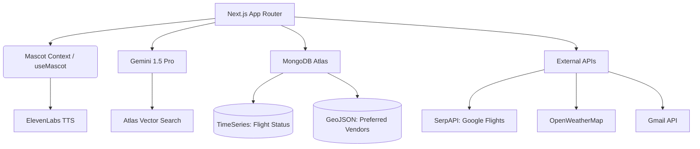

<div align="center">
  
  <h1>Lockey</h1>
  <p><i>Motto in progress</i></p>

  [](https://nextjs.org/)
  [](https://www.typescriptlang.org/)
  [](https://tailwindcss.com/)
  [](https://www.mongodb.com/atlas)
  [](https://ai.google.dev/)
  [](https://elevenlabs.io/)
</div>

---

## 🚀 Overview

**Lockey** is an AI-powered corporate travel concierge designed to streamline the entire travel lifecycle. From the initial spark of planning to post-trip expense reporting, Lockey acts as a tireless, empathetic 2D mascot that guides travelers through policy compliance, live disruptions, and logistical hurdles.

Built for **HackKU**, Lockey leverages cutting-edge AI (Google Gemini 1.5 Pro), multimodal vision, and real-time data to ensure corporate travelers stay focused on their work, while the concierge handles the rest.

---

## 🧠 Inspiration
Lockey emerged as an answer to Lockton Companies’ search for a solution to the stressful, often bureaucratic nightmare that business travel can become. Many people have stories about missed flights, confusing expense policies, or the frustration of waiting for a manager to approve a last-minute booking. Lockey is our attempt to turn those feared, disconnected tasks into a single, guided conversation with a companion that anticipates what you need before you even ask.

---

## ✨ Key Pillars

- **🤖 Proactive AI Concierge**: A 2D mascot with emotional intelligence, powered by ElevenLabs TTS, that shifts its tone (neutral, excited, empathetic, urgent) based on the travel context.
- **🗺️ Intelligent Planning**: A "Fair Grid" flight search algorithm that finds the best value by scanning multiple airports and dates, coupled with Geo-aware hotel search.
- **🛡️ Policy & Compliance**: Real-time vector search against corporate travel handbooks to ensure every booking is within budget and compliant with visa requirements.
- **⚡ Crisis Management**: Real-time disruption handling using MongoDB TimeSeries collections. If a flight is delayed, Lockey automatically finds alternatives and drafts exception requests.
- **📸 Multimodal Expenses**: Snap a photo of any receipt, and Gemini 1.5 Pro extracts the merchant, amount, and currency, automatically converting it to USD and filing it.

---

## 🛠️ Technical Deep Dive

### 🔍 Vector Search & RAG
Lockey uses **MongoDB Atlas Vector Search** to perform Retrieval-Augmented Generation (RAG). Corporate policies and visa requirements are embedded using `text-embedding-004` (now `gemini-embedding-001`) and stored in Atlas. When a user plans a trip, Lockey queries these embeddings to provide instant, context-aware policy summaries.

### 📊 Fair Grid Flight Search
The Fair Grid algorithm expands the search radius up to 100 miles and explores a 5-day window. It calculates "Saturday-night savings" and presents three distinct bundles (Standard, Savings, and Value-Add) to the traveler.

### 🕒 TimeSeries & Live Mode
Flight statuses are tracked in a **MongoDB TimeSeries collection**, allowing Lockey to monitor for delays or cancellations. When a disruption is detected, a crisis workflow is triggered, leveraging Gemini to synthesize a rebooking strategy and draft communications to managers.

### 👁️ Multimodal Vision
The expense reporting system uses **Gemini 1.5 Pro's vision capabilities** to process receipts. It identifies PII, extracts financial data, and performs currency conversion in a single pass, ensuring high accuracy even for handwritten or poorly lit receipts.

---

## 🏗️ Architecture



---

## 💻 Tech Stack

| Layer | Technology |
|---|---|
| **Framework** | Next.js 16 (App Router) |
| **Language** | TypeScript |
| **Styling** | Tailwind CSS 4 |
| **Database** | MongoDB Atlas (Vector Search, GeoJSON, TimeSeries) |
| **AI (Text/Vision)**| Google Gemini 1.5 Pro |
| **AI (Voice)** | ElevenLabs TTS (4 emotional tones) |
| **Auth** | NextAuth.js + Google OAuth |
| **APIs** | SerpAPI, OpenWeatherMap, Gmail API |

---

## 🏁 Getting Started

### Prerequisites
- Node.js 20+
- MongoDB Atlas Cluster (Free Tier)
- API Keys: Google AI Studio, ElevenLabs, SerpAPI, OpenWeatherMap, Google Cloud Console

### Setup

1. **Clone & Install**:
   ```bash
   git clone https://github.com/AruneemB/lockey.git
   cd lockey
   npm install
   ```

2. **Environment Configuration**:
   Create a `.env.local` file with the following:
   ```env
   MONGODB_URI=your_mongodb_uri
   NEXTAUTH_SECRET=your_secret
   GOOGLE_CLIENT_ID=your_google_id
   GOOGLE_CLIENT_SECRET=your_google_secret
   GEMINI_API_KEY=your_gemini_key
   ELEVENLABS_API_KEY=your_elevenlabs_key
   ELEVENLABS_VOICE_ID=your_voice_id
   SERPAPI_KEY=your_serpapi_key
   OPENWEATHERMAP_KEY=your_openweathermap_key
   ```

3. **Database Seeding**:
   ```bash
   npm run seed          # Seeds users, policies, vendors, and visa info
   npm run create-index  # Creates the Atlas Vector Search index
   ```

4. **Run Dev Server**:
   ```bash
   npm run dev
   ```

---

## 🎭 Demo Flow

1. **Onboarding**: Sign in via Google. Lockey greets you and identifies an expiring passport.
2. **Planning**: Search for a trip (e.g., Milan, Italy). Watch Lockey analyze 100+ flight combinations.
3. **Compliance**: View the policy summary generated via Vector Search.
4. **Approval**: Select a bundle. Lockey drafts a rationale and sends a Gmail approval request.
5. **Live Mode**: Experience a simulated flight delay. Lockey's tone shifts to empathetic/urgent as it provides a rebooking solution.
6. **Post-Trip**: Scan a physical receipt. Watch Gemini extract data and finalize the expense report.

---

<div align="center">
  Built with ❤️ for HackKU 2026
</div>
